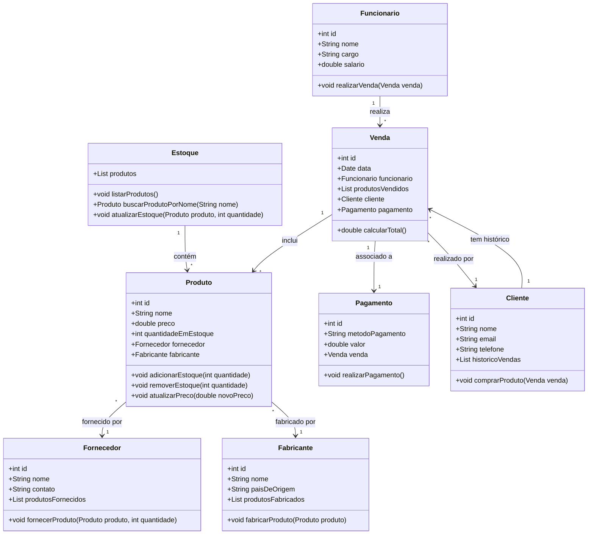

## Diagrama de Classes - Sujeito a fortes alterações
 

```mermaid
classDiagram
    class Fornecedor {
        +int id
        +String nome
        +String contato
        +List<Produto> produtosFornecidos
        +void fornecerProduto(Produto produto, int quantidade)
    }

    class Fabricante {
        +int id
        +String nome
        +String paisDeOrigem
        +List<Produto> produtosFabricados
        +void fabricarProduto(Produto produto)
    }

    class Produto {
        +int id
        +String nome
        +double preco
        +int quantidadeEmEstoque
        +Fornecedor fornecedor
        +Fabricante fabricante
        +void adicionarEstoque(int quantidade)
        +void removerEstoque(int quantidade)
        +void atualizarPreco(double novoPreco)
    }

    class Estoque {
        +List<Produto> produtos
        +void listarProdutos()
        +Produto buscarProdutoPorNome(String nome)
        +void atualizarEstoque(Produto produto, int quantidade)
    }

    class Funcionario {
        +int id
        +String nome
        +String cargo
        +double salario
        +void realizarVenda(Venda venda)
    }

    class Venda {
        +int id
        +Date data
        +Funcionario funcionario
        +List<Produto> produtosVendidos
        +Cliente cliente
        +Pagamento pagamento
        +double calcularTotal()
    }

    class Pagamento {
        +int id
        +String metodoPagamento
        +double valor
        +Venda venda
        +void realizarPagamento()
    }

    class Cliente {
        +int id
        +String nome
        +String email
        +String telefone
        +List<Venda> historicoVendas
        +void comprarProduto(Venda venda)
    }

    Produto "*" --> "1" Fornecedor : fornecido por
    Produto "*" --> "1" Fabricante : fabricado por
    Estoque "1" --> "*" Produto : contém
    Venda "1" --> "*" Produto : inclui
    Funcionario "1" --> "*" Venda : realiza
    Venda "1" --> "1" Pagamento : associado a
    Venda "*" --> "1" Cliente : realizado por
    Cliente "1" --> "*" Venda : tem histórico
```
